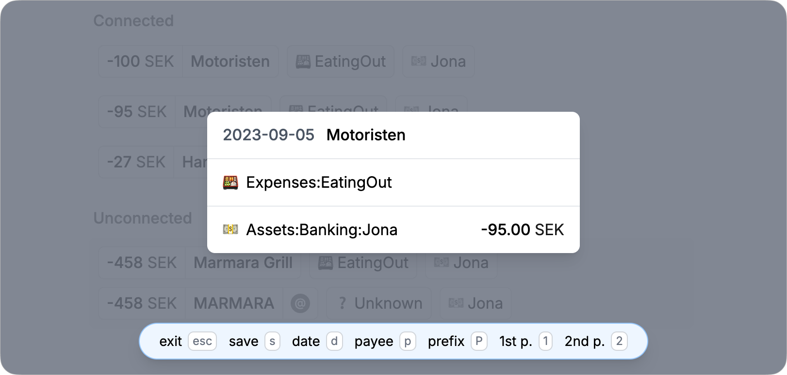

# Tally



> Efficient plain text accounting – a node.js (remix) application to quickly account for new transactions on the local file system. A mix of editing ledger files and importing `.csv` bank statements, and in the future project and visualize accounting data...

## Background

I enyoyed YNAB, a proprietary application for envelope budgeting. What I appreciate most was the categorization of costs, in favour of independence i found my way to plain text accounting. While using some scripts for importing bank statements and visualsing montlhy costs across categories i found the editing of ledger files a bit tedious, the recognision data for automatically assigning accounts and payees from bank statements could also do with a swifter UI.

I thereafter concluded that the most efficient way I could develop an application for these purposes was a node.js backend that would read from my ledger directory locally and provide a react based interface. This way i could version controll my ledger files as usual. For this remix felt like a good match – and it has worked quite well.

## The Approach

By configuring the `.env` file the app is ready to read data from the `DATA_DIR`. The data directory should follow a structure like:

- main.ledger
- [year] (e.g. 2022)
  - [month].ledger (e.g. 01.ledger)
  - *.csv (e.g. my-account-2022.csv)

Transactions are read and written in separate ledger files for every year + month and the data directory should reflect that. All `.csv` files added to the year directories will be parsed by the system. I add one for each bank account...

At the heart of the system is the `main.ledger`, this needs to define all the accounts used. It can also include all the months ledger files, so that the main file may be used with other plain-text-accounting tools (e.g. the ledger cli).

A primary part of Tally is that is reads the .csv and infers transactions from it based on metadata stored in the `main.ledger`, these inferred transactions can then be directly accepted, edited and accepted or connected to an existing transaction (manually or auto-matched).

Metadata in the main ledger file is provided in comments. Each account can have a
- `match` to match the account against descriptions in the csv files as well as providing a payee name
- `accountNo` to match asset account (my owned account) to csv files
- `icon` to add an emoji the each account for simple recognision

Before the accounts section a

- `csv` comment should also be added to map the headings of the csv files to the fields used then integrating the data to the system.

See the example directory...

## Roadmap

Right now all metadata is edited only through text editor of choice. More prioritised tasks are to:

- [ ] Complete editability of transactions – so that i can begin to do my accounting from here.
- [ ] Visualise monthly overview of accounts costs – this way i can start to understand my previous years costs, after it has been accounted for...
- [ ] Visualise payee overview on monthly basis – group payee transactions together and give highlights to those transactions that are out of the ordinary.

## Run it

```bash
npm run dev
```

